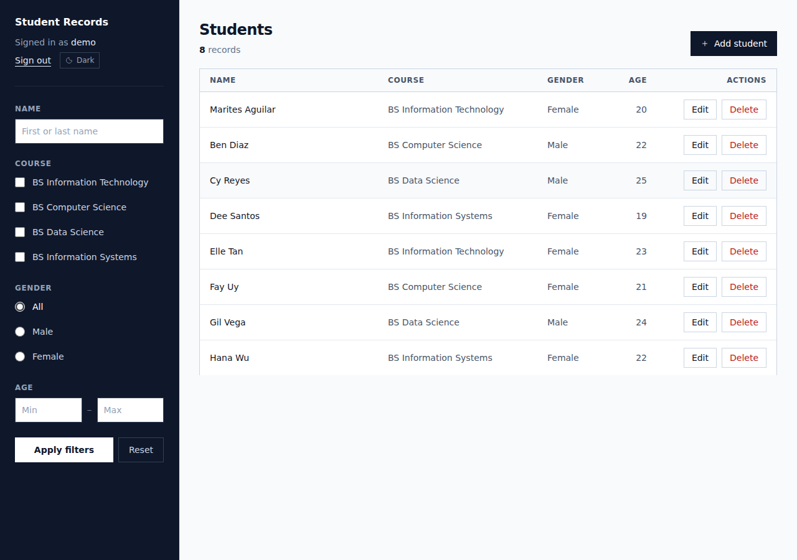
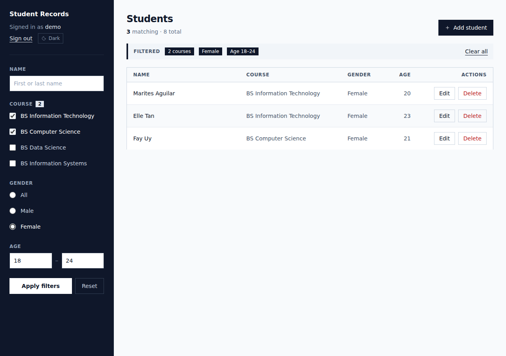
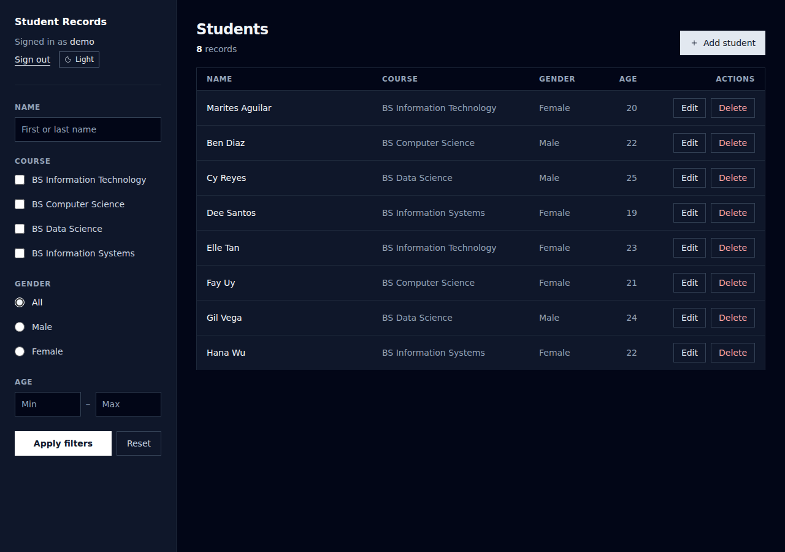
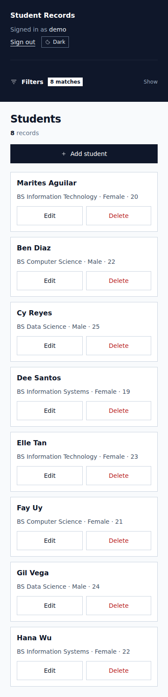

# mini-addu-sis

A student records system for staff. Search, filter and sort the roster, add and edit
records, delete one or many behind a confirmation page, and export whatever the current
filter matches as CSV. Signing in is required for everything, and dark mode is remembered
across visits.

Built for IT 2241 *Event-Driven Programming* at Ateneo de Davao University, 2nd Semester
A.Y. 2023–2024 — a Django 5 application on SQLite with server-rendered templates and
Tailwind CSS 3 compiled to a static stylesheet. The three coursework milestones are on the
`archive/milestone-*` branches.

```bash
git clone https://github.com/clarknotkent/EDP-IT-2241.git
cd EDP-IT-2241
python -m venv .venv && source .venv/bin/activate
pip install -r requirements.txt
python manage.py migrate
python manage.py createsuperuser
python manage.py runserver
```

Then open **http://127.0.0.1:8000/**.



---

## What it does

CRUD over a single `StudentRecord` table, with server-side search and filtering.

- **List** every record, with combined filters: name search, multi-select course, gender,
  and an inclusive age range — all composing into one queryset.
- **Sign-in required for everything.** Student records are staff-only; an anonymous
  visitor is redirected to the login page and sees no data at all.
- **Sort** on any column. The link carries the active filters and resets to page 1, and
  sets `aria-sort` so the order is announced, not just drawn.
- **Paginate** at 25 per page, with the active filters carried through the page links.
- **Export CSV** of everything currently matching — not just the page on screen.
- **A page per record**, so a student has an address that isn't an edit form.
- **Delete one or many**, each behind a real confirmation page that names what will go.
  No `confirm()` dialog, so it works with JavaScript off.
- **Dark mode**, remembered across visits and applied before first paint.
- **Django admin** at `/admin/`, with list filters and search.

| Route | Purpose | Auth |
|-------|---------|------|
| `/` | Student list, search and filters | required |
| `/add/` | Create | required |
| `/<pk>/edit/` | Update | required |
| `/<pk>/` | One record | required |
| `/<pk>/delete/` | Confirm on GET, delete on POST | required |
| `/bulk-delete/` | Confirm and delete a selection | required |
| `/export.csv` | CSV of the current filter | required |
| `/accounts/password_change/` | Change your password | required |
| `/accounts/login/` | Sign in | — |
| `/admin/` | Django admin | staff |

Filters compose, survive pagination, and say what they are:



Dark mode is a class on `<html>`, stored in `localStorage` and read in `<head>` before
first paint so it never flashes light. Below `md` the table becomes one card per record
and the filter panel collapses.

| | |
|---|---|
|  |  |

## Layout

```
.
├── manage.py
├── config/
│   ├── settings/
│   │   ├── base.py          shared
│   │   ├── dev.py           DEBUG on, throwaway key
│   │   └── prod.py          refuses to start without a real key
│   ├── urls.py  asgi.py  wsgi.py
├── students/
│   ├── models.py  forms.py  views.py  urls.py  admin.py
│   ├── migrations/
│   ├── selectors.py         filtering and sorting, shared by list and export
│   └── tests/               91 tests
├── templates/               project-level, not buried in the app
├── static/css/app.css       built Tailwind, 15 KB
├── docs/
├── requirements.txt
└── .env.example
```

`manage.py` defaults to `config.settings.dev`; `wsgi.py` and `asgi.py` default to
`config.settings.prod`, so a deployment cannot accidentally serve with `DEBUG` on.

## Development

```bash
pip install -r requirements-dev.txt

python manage.py test               # 91 tests
coverage run manage.py test && coverage report
ruff check .

npm install && npm run build:css    # only if you change template markup
```

CI runs all of that on every push, plus `check --deploy` against the production settings
and `makemigrations --check`, so a model cannot be committed without its migration.

Styling is Tailwind, compiled to `static/css/app.css` and committed. **Node is only needed
if you change the templates** — a fresh clone runs on `pip install` alone.

## Credits

**IT 2241 — Event-Driven Programming**
2nd Semester, AY 2023–2024 · Ateneo de Davao University
Instructor: Dwight Ian De Jesus

Group project by:

- Kent Elrond Andionne L. Aspa
- Dominic Carlo Bolivar

**Every person in the sample data is fictional.** Any resemblance to a real student is a
leftover we would want to know about.

## Contact

Kent Elrond Andionne L. Aspa — [@clarknotkent](https://github.com/clarknotkent)
